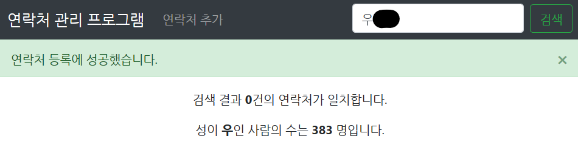

# dbms-assignment-2


PostgreSQL과 FastAPI를 이용한 연락처 관리 프로그램 Full Stack입니다.

- [dbms-assignment-2](#dbms-assignment-2)
  - [How to deploy](#how-to-deploy)
  - [과제 진행 설명](#%ea%b3%bc%ec%a0%9c-%ec%a7%84%ed%96%89-%ec%84%a4%eb%aa%85)
    - [1. 백엔드 구현](#1-%eb%b0%b1%ec%97%94%eb%93%9c-%ea%b5%ac%ed%98%84)
      - [백엔드와 DB와의 연결 (`src/database.py`)](#%eb%b0%b1%ec%97%94%eb%93%9c%ec%99%80-db%ec%99%80%ec%9d%98-%ec%97%b0%ea%b2%b0-srcdatabasepy)
      - [Object Relational 모델링 (`src/models.py`)](#object-relational-%eb%aa%a8%eb%8d%b8%eb%a7%81-srcmodelspy)
      - [쿼리 자료형 지정 (`src/schemas.py`)](#%ec%bf%bc%eb%a6%ac-%ec%9e%90%eb%a3%8c%ed%98%95-%ec%a7%80%ec%a0%95-srcschemaspy)
      - [받은 Request의 처리 (`src/crud.py`)](#%eb%b0%9b%ec%9d%80-request%ec%9d%98-%ec%b2%98%eb%a6%ac-srccrudpy)
      - [백엔드 기능 설정 (`src/main.py`)](#%eb%b0%b1%ec%97%94%eb%93%9c-%ea%b8%b0%eb%8a%a5-%ec%84%a4%ec%a0%95-srcmainpy)
    - [2. 백엔드 검증](#2-%eb%b0%b1%ec%97%94%eb%93%9c-%ea%b2%80%ec%a6%9d)
      - [Swagger UI 접속](#swagger-ui-%ec%a0%91%ec%86%8d)
      - [`contact.csv` 파싱 (`test/test.py`)](#contactcsv-%ed%8c%8c%ec%8b%b1-testtestpy)
    - [3. 프론트엔드 구현](#3-%ed%94%84%eb%a1%a0%ed%8a%b8%ec%97%94%eb%93%9c-%ea%b5%ac%ed%98%84)
      - [페이지의 기본 틀 지정 (src/templates/index.html)](#%ed%8e%98%ec%9d%b4%ec%a7%80%ec%9d%98-%ea%b8%b0%eb%b3%b8-%ed%8b%80-%ec%a7%80%ec%a0%95-srctemplatesindexhtml)
      - [프론트엔드 기능 구현 (`src/static/index.js`)](#%ed%94%84%eb%a1%a0%ed%8a%b8%ec%97%94%eb%93%9c-%ea%b8%b0%eb%8a%a5-%ea%b5%ac%ed%98%84-srcstaticindexjs)
    - [4. 테스트 시나리오](#4-%ed%85%8c%ec%8a%a4%ed%8a%b8-%ec%8b%9c%eb%82%98%eb%a6%ac%ec%98%a4)
      - [(1) 연락처 관리 페이지 접속](#1-%ec%97%b0%eb%9d%bd%ec%b2%98-%ea%b4%80%eb%a6%ac-%ed%8e%98%ec%9d%b4%ec%a7%80-%ec%a0%91%ec%86%8d)
      - [(2) 본인 이름 검색](#2-%eb%b3%b8%ec%9d%b8-%ec%9d%b4%eb%a6%84-%ea%b2%80%ec%83%89)
      - [(3) 연락처 추가](#3-%ec%97%b0%eb%9d%bd%ec%b2%98-%ec%b6%94%ea%b0%80)
      - [(4) 새 창 접속](#4-%ec%83%88-%ec%b0%bd-%ec%a0%91%ec%86%8d)
      - [(5) 본인 이름 재검색](#5-%eb%b3%b8%ec%9d%b8-%ec%9d%b4%eb%a6%84-%ec%9e%ac%ea%b2%80%ec%83%89)
      - [(6) 본인 연락처 삭제](#6-%eb%b3%b8%ec%9d%b8-%ec%97%b0%eb%9d%bd%ec%b2%98-%ec%82%ad%ec%a0%9c)
      - [(7) 새 창 접속 후 본인 이름 재검색](#7-%ec%83%88-%ec%b0%bd-%ec%a0%91%ec%86%8d-%ed%9b%84-%eb%b3%b8%ec%9d%b8-%ec%9d%b4%eb%a6%84-%ec%9e%ac%ea%b2%80%ec%83%89)
  - [데모 사이트](#%eb%8d%b0%eb%aa%a8-%ec%82%ac%ec%9d%b4%ed%8a%b8)

## How to deploy

Docker 실행 권한이 없을 시:

`$ sudo docker-compose -f docker-compose.yml -f docker-compose.prod.yml up -d`

Docker 실행 권한이 있을 시:

`# docker-compose -f docker-compose.yml -f docker-compose.prod.yml up -d`

이후 http://localhost 으로 접속하면 페이지가 보입니다.

## 과제 진행 설명

### 1. 백엔드 구현

JSON을 통해 프론트엔드와 DB 사이의 통신을 진행해 줄 백엔드를 구현하기 위해 [FastAPI](https://fastapi.tiangolo.com)를 사용하였습니다. 각 파일의 역할은 다음과 같습니다:

#### 백엔드와 DB와의 연결 (`src/database.py`)

```Python
# src/database.py
# PostgreSQL과의 통신을 위한 SQLAlchemy Session을 만드는 모듈

# Docker 이미지에 등록된 환경 변수를 추출하기 위한 모듈
from os import environ

from sqlalchemy import create_engine
from sqlalchemy.ext.declarative import declarative_base
from sqlalchemy.orm import sessionmaker

user = environ["POSTGRES_USER"]
password = environ["POSTGRES_PASSWORD"]
host = environ["POSTGRES_HOST"]
dbname = environ["POSTGRES_DB"]
SQLALCHEMY_DATABASE_URL = f"postgresql://{user}:{password}@{host}/{dbname}"

engine = create_engine(SQLALCHEMY_DATABASE_URL)
SessionLocal = sessionmaker(autoflush=False, bind=engine)

Base = declarative_base()

```

PostgreSQL과의 통신을 위해 [SQLAlchemy](https://www.sqlalchemy.org/) 모듈을 이용하였습니다. `psycopg2-binary` 모듈로 SQL Query를 DB 서버에 직접 전송하는 방법도 있지만, 좀 더 고수준의 조작을 통해 생산성을 높이기 위해 SQLAlchemy를 거치어 통신하도록 하였습니다.

Docker에서 사용할 환경 변수는 `app.env` 파일에서 지정할 수 있습니다:

```Text
# app.env
POSTGRES_HOST=db
POSTGRES_DB=dbapp
POSTGRES_USER=dbuser
POSTGRES_PORT=5432
POSTGRES_PASSWORD=1234
```

#### Object Relational 모델링 (`src/models.py`)

```Python
# src/models.py
# PostgreSQL에 저장할 Table의 구성을 지정하는 모듈

from sqlalchemy import Boolean, Column, ForeignKey, Integer, Sequence, String, Table
from sqlalchemy.orm import relationship

from .database import Base


class User(Base):
    __tablename__ = "users"

    id = Column(Integer, Sequence("user_id_seq"), primary_key=True)
    name = Column(String, nullable=False)
    phone = Column(String(length=11), nullable=False)
```

`src/database.py`에서 만든 `Base` 객체에 저장할 자료형을 선언하는 모듈입니다. 과제에서 주어진 연락처에 들어가야 할 요소는 이름, 전화번호 두 가지이며, 이름은 길이가 관계 없는 문자열, 전화번호는 길이가 11인 문자열로 지정하였습니다. 공백을 불허하므로 `NOT NULL`을 추가시켜주었습니다.

추가적으로, 데이터베이스에서 특정 자료를 접근하기 쉽도록 매 생성 시 고유한 id를 발급하도록 설정하였습니다. 이 id는 PostgreSQL에서 순차적으로 생성하며, `PRIMARY KEY`이므로 중복이 될 수 없습니다.

#### 쿼리 자료형 지정 (`src/schemas.py`)

```Python
# src/schemas.py
# 프론트엔드와의 통신에 사용할 데이터의 형식을 지정해주는 모듈

from typing import List

from pydantic import BaseModel, Schema


class UserBase(BaseModel):
    name: str = Schema(None, min_length=1)
    phone: str = Schema(None, regex="010\d\d\d\d\d\d\d\d")


class User(UserBase):
    id: int

    class Config:
        orm_mode = True


class SearchResult(BaseModel):
    # 파싱한 쿼리의 성
    first_name: str
    # 파싱한 쿼리의 성과 같은 성을 가진 사람의 수
    first_name_number: int
    # 파싱한 쿼리와 이름의 앞부분 일치하는 사람의 수
    number: int
    # 파싱한 쿼리와 이름의 앞부분이 일치하는 사람의 목록
    # (skip만큼 건너뛰고 limit만큼만 가져온다)
    user_list: List[User]


class DeleteResult(BaseModel):
    result: bool = False


class Message(BaseModel):
    detail: str = "User not found"
```

SQLAlchemy에서 사용하는 자료형은 제가 사용할 FastAPI와의 호환이 보장되어 있지 않습니다. 따라서 이를 JSON으로 쉽게 변환할 수 있도록 Python에서 다루는 자료형으로 변환될 수 있어야 합니다. FastAPI에서는 이를 `pydantic` 모듈을 사용하여 해결합니다.

먼저 기본이 되는 `UserBase` 클래스를 선언합니다. 여기에서 이름과 전화번호의 자료형이 지정됩니다. (전화번호는 정규식을 통해 010으로 시작하는 11자리의 수로 이루어진 문자열만 받도록 하였습니다.) 이 클래스에 확장하여 사용자의 고유 ID가 포함된 `User` 클래스를 선언하였습니다.

검색 결과에는 성이 같은 사람의 수가 포함되어야 하므로, 이를 포함한 결과를 반환하도록 지정했습니다.

삭제 결과에는 성공/실패 여부만 반환하도록 지정했습니다.

만일 HTTP Request에서 존재하지 않는 사용자를 찾도록 한 경우, Response Code 404에 넣을 메시지도 추가적으로 지정했습니다.

#### 받은 Request의 처리 (`src/crud.py`)

```Python
# src/crud.py
# CRUD(create, read, update, delete)를 수행하기 위한 모듈

from sqlalchemy.orm import Session
from . import models, schemas


def get_user(db: Session, user_id: int):
    return db.query(models.User).filter_by(id=user_id).first()


def get_users_by_name(db: Session, name: str, skip: int, limit: int):
    # 검색할 이름이 비어있는 경우, 전체 유저 출력을 쿼리하며, 성이 같은 사람을 찾지 않음
    if name is None:
        q = db.query(models.User)
        first_name = ""
        first_name_number = 0
    # 검색할 이름이 있는 경우, 해당 이름으로 시작하는 유저 출력을 쿼리하며,
    # 동시에 성이 같은 사람의 수를 찾음
    else:
        q = db.query(models.User).filter(models.User.name.like(f"{name}%"))
        first_name = name[0]
        first_name_number = (
            db.query(models.User)
            .filter(models.User.name.like(f"{first_name}%"))
            .count()
        )

    return {
        "first_name": first_name,
        "first_name_number": first_name_number,
        "number": q.count(),
        "user_list": q.offset(skip).limit(limit).all(),
    }


def create_user(db: Session, user: schemas.UserBase):
    db_user = models.User(name=user.name, phone=user.phone)
    db.add(db_user)
    db.commit()
    db.refresh(db_user)
    return db_user


def update_user(db: Session, user_id: int, user: schemas.UserBase):
    db_user = get_user(db=db, user_id=user_id)
    db_user.name = user.name
    db_user.phone = user.phone
    db.commit()
    db.refresh(db_user)
    return db_user


def delete_user(db: Session, user_id: int):
    db_user = get_user(db=db, user_id=user_id)
    db.delete(db_user)
    db.commit()
    if get_user(db=db, user_id=user_id) is not None:
        return False
    else:
        return True
```

보통 DBMS와 자료를 다루는 기본적인 작업을 CRUD라는 줄임말로 많이 표현합니다. 이 모듈에서는 그 CRUD를 수행합니다.

기능 수행의 기반 작업을 위해, 사용자의 id를 이용하여 해당 id를 가지는 사용자를 찾아내는 `get_user()` 함수를 선언하였습니다. 이 함수는 CRUD 작업이 정상적으로 완료되었는지 확인하는 등에 쓰입니다.

쿼리 검색은 SQLAlchemy의 `.filter()`를 이용하였습니다. 유저가 전송한 쿼리로 시작하는 모든 결과를 출력해야 하므로, SQL의 `LIKE` 쿼리에 해당하는 `.like()`를 이용하여 쿼리의 내용을 포함하는 사용자를 일괄 검색하도록 하였습니다. 성이 같은 사람의 수를 찾아야 하는 경우, 이름의 문자열의 맨 앞 글자만을 이용하여 검색을 시행하여 그 수를 `.count()`로 취득하였습니다.

연락처 추가는 입력받은 이름/전화번호를 기반으로 데이터베이스에 그대로 추가한 후, 추가된 사용자의 정보를 반환해줍니다. 데이터의 무결 검증은 프론트엔드와 백엔드에서 미리 처리하므로 별도의 검증을 시행하지 않습니다.

연락처 수정은 입력받은 `user_id`를 사용하여 `get_user()`로 해당 사용자의 정보를 얻어, 입력받은 이름/전화번호로 기존 내용을 덮어씌우도록 하였습니다. 역시 무결 검증은 따로 시행하지 않습니다.

연락처 삭제 또한 입력받은 `user_id`를 사용하여 `get_user()`로 해당 사용자의 정보를 얻은 후, 이 유저를 데이터베이스에서 제거한 후, 제거 성공 여부를 반환하도록 하였습니다.

SQLAlchemy는 추가/수정/삭제에 해당하는 모든 쿼리를 바로 시행하지 않고 언제든 `.rollback()` 할 수 있도록 유예를 둡니다. 이를 시행시키기 위해서 작업을 끝낸 후에는 항상 `.commit()`을 통해 DB에 최종적으로 적용시켜줘야 합니다.

#### 백엔드 기능 설정 (`src/main.py`)

```Python
# src/main.py
# 주소의 Routing을 포함한 기본 작동을 다루는 모듈

from fastapi import Depends, FastAPI, HTTPException, Query
from sqlalchemy.orm import Session
from starlette import status
from starlette.requests import Request
from starlette.responses import FileResponse, JSONResponse
from starlette.staticfiles import StaticFiles
from starlette.templating import Jinja2Templates

# DB를 다루기 위한 모듈
from . import crud, models, schemas
from .database import SessionLocal, engine

# Base에 저장시킨 메타데이터에 따라 DB 테이블 생성
# (DB에 테이블이 있을 시 무시됨)
models.Base.metadata.create_all(engine)

# 백엔드를 구성하기 위한 기본 변수들을 선언
app = FastAPI()
app.mount("/static", StaticFiles(directory="app/static"), name="static")
templates = Jinja2Templates(directory="app/templates")

# 검색 봇들을 차단하는 Robots.txt
@app.get("/robots.txt")
def robots():
    return FileResponse(
        "/app/robots.txt", filename="robots.txt", media_type="text/plain"
    )


# CRUD 작업에 사용할 DB 세션을 선언하는 기저함수
def get_db():
    try:
        db = SessionLocal()
        yield db
    finally:
        db.close()


# # 어플리케이션 종료 시, DB의 모든 테이블 삭제 (디버깅용)
# @app.on_event("shutdown")
# async def shutdown():
#     Base.metadata.drop_all(engine)


# Root에 접근 시, templates 폴더에 있는 index.html을 반환한다.
@app.get("/")
def index(request: Request):
    return templates.TemplateResponse("index.html", {"request": request})


# Create
@app.post(
    "/api/users/", status_code=status.HTTP_201_CREATED, response_model=schemas.User
)
def create_user(user: schemas.UserBase, db: Session = Depends(get_db)):
    return crud.create_user(db=db, user=user)


# Read (Finding user(s) with query)
@app.get("/api/users/", response_model=schemas.SearchResult)
def read_users(
    name: str = Query(None),
    skip: int = 0,
    limit: int = 100,
    db: Session = Depends(get_db),
):
    return crud.get_users_by_name(db=db, name=name, skip=skip, limit=limit)


responses = {404: {"model": schemas.Message}}

# Read (One user)
@app.get("/api/users/{user_id}", response_model=schemas.User, responses=responses)
def read_user(user_id: int, db: Session = Depends(get_db)):
    db_user = crud.get_user(db=db, user_id=user_id)
    # 해당 user_id를 가진 유저가 없을 경우,
    # status code 404를 반환한다
    if db_user is None:
        return JSONResponse(
            status_code=status.HTTP_404_NOT_FOUND, content={"detail": "User not found"}
        )
    else:
        return db_user


# Update
@app.put("/api/users/{user_id}", response_model=schemas.User, responses=responses)
def update_user(user_id: int, user: schemas.UserBase, db: Session = Depends(get_db)):
    db_user = crud.get_user(db=db, user_id=user_id)
    # 삭제하고자 하는 user_id에 해당하는 유저가 없을 경우,
    # status code 404를 반환한다
    if db_user is None:
        return JSONResponse(
            status_code=status.HTTP_404_NOT_FOUND, content={"detail": "User not found"}
        )
    else:
        return crud.update_user(db=db, user_id=user_id, user=user)


# Delete
@app.delete(
    "/api/users/{user_id}", response_model=schemas.DeleteResult, responses=responses
)
def delete_user(user_id: int, db: Session = Depends(get_db)):
    # 삭제하고자 하는 user_id에 해당하는 유저가 없을 경우,
    # status code 404를 반환한다
    if crud.get_user(db=db, user_id=user_id) is None:
        return JSONResponse(
            status_code=status.HTTP_404_NOT_FOUND, content={"detail": "User not found"}
        )

    result = crud.delete_user(db=db, user_id=user_id)
    return {"result": result}
```

메인 파일에서는 프론트엔드와 통신하는 핵심 기능을 제어합니다. FastAPI는 URI에 들어오는 HTTP Request의 종류에 따라 거기에 맞는 동작을 시행하도록 설정할 수 있습니다. 이미 대부분의 기능 구현은 다른 모듈에서 끝마친 상태이므로, 실제로 이 파일에서 맡는 기능은 FastAPI 객체의 선언 및 URI 처리 방법 설정이 대부분입니다.

백엔드에서는 /api/users URI에 들어오는 `GET`, `POST`, `PUT`, `DELETE`를 인지한 후, 각 Request에 맞는 동작을 수행하도록 하였습니다. 예를 들어, /api/users/?name=(검색어) 으로 `GET` Request로 들어온 경우, 해당 검색어를 `crud.get_users_by_name()` 함수로 전달한 후 결과를 JSON으로 반환해주는 검색 기능을 수행하며, /api/users/(사용자 ID) 으로 `DELETE` Request가 들어온 경우, `crud.delete_user()` 함수를 통해 지정한 사용자 ID에 해당하는 사용자를 삭제하는 기능을 수행합니다.

만약 클라이언트가 요청한 작업이 제대로 수행된 경우 `200 OK` (`POST` Request의 경우 `201 Created`) Status Code를 전달하며, 잘못된 접근을 한 경우 `404 Not Found` Status Code를 전달하도록 지정하였습니다. 이와 별도로, FastAPI에서는 Schema에 지정된 형식과 다른 자료형(정규식 포함)이 전달될 경우 `422 Unprocessable Entity` Status Code를 반환함과 동시에 고쳐야 하는 syntex를 알려주는 기능이 포함되어 있으므로, 백엔드에 전달해야 할 자료의 무결성을 파악해 주는 무결성 처리까지 가능합니다.

### 2. 백엔드 검증

#### Swagger UI 접속


FastAPI는 자체적인 OpenAPI 문서화 도구인 'Swagger UI'를 내장하고 있습니다. 백엔드를 deploy한 상태로 /docs 를 접속하면 위와 같은 UI가 나옵니다.

각 줄은 특정 URI에 어떤 Request가 들어갈 수 있는지를 나타내며, 이를 클릭할 시 해당 Request를 직접 시험해 볼 수 있습니다.

예를 들어, 위 스크린샷에서 `PUT`을 클릭할 경우, 아래와 같은 인터페이스가 나옵니다:


이 인터페이스에서는 URI에 넣을 수 있는 파라미터를 알아볼 수 있으며, Request body에 들어가야 하는 내용 또한 확인할 수 있습니다. 또한 실제로 해당 Request를 수행할 때 어떤 Response가 나오는지 `curl`을 이용하여 확인 또한 가능합니다.

해당 도구에서 FastAPI로 구현한 기능들을 모두 시험한 결과, 의도한 대로 작동하는 것을 확인하였습니다.

#### `contact.csv` 파싱 (`test/test.py`)

```Python
# test/test.py

import requests, csv, json

def test_post_data():
    with open("contact.csv", "r", encoding="UTF-8") as input_file:
        reader = csv.DictReader(input_file)
            for row in reader:
                r = requests.post("http://localhost:8000/api/users", data=json.dumps(row))
                assert r.status_code == 201

if __name__ == "__main__":
    test_post_data()
```

주어진 contact.csv 파일은 자료의 이름이 적혀 있는 첫 번째 줄과 context인 나머지 줄로 이루어져 있습니다. 이를 Python의 내장 함수인 `csv.DictReader()`를 이용하여 읽을 시, `[("name", "(이름)"), ("phone", "(번호)")]` 형태의 `OrderedDict` 자료형으로 반환해줍니다.

이를 `json.dumps()`에 넣어주면 JSON으로 인코딩 된 문자열을 얻을 수 있습니다. 이 JSON을 `requests` 모듈을 이용하여 /api/users/ URI에 `POST` 형태로 HTTP 요청을 전송하였습니다.

앞서 언급하였듯이, 데이터베이스에 연락처가 성공적으로 추가된 경우 백엔드는 HTTP Status Code 201(Created)를 반환하도록 약속되어 있으므로, 이를 `assert` 키워드를 이용하여 검증합니다.

이렇게 진행을 한 이유는 다음과 같습니다:

1. 백엔드 작동 확인을 위한 테스트 코드 겸용
2. 데이터 추가를 위해 DB와 통신할 모듈을 따로 추가하지 않아도 됨

### 3. 프론트엔드 구현

#### 페이지의 기본 틀 지정 (src/templates/index.html)

(지면 관계 상 일부 코드를 축약하였으므로 실제 코드와는 차이가 있습니다.)

```HTML
<!-- src/templates/index.html -->
<!DOCTYPE html>
<html lang="ko">
  <head>
    <meta charset="utf-8" />
    <meta    name="viewport"
      content="width=device-width, initial-scale=1, shrink-to-fit=no"
    />
    <title>DBMS assignment 2</title>
    <link rel="stylesheet"
      href="https://stackpath.bootstrapcdn.com/bootstrap/4.3.1/css/bootstrap.min.css"
    />
  </head>

  <body>
    <!-- 헤더 -->
    <header class="navbar navbar-expand-md navbar-dark bg-dark">
      <span class="navbar-brand">연락처 관리 프로그램</span>
      (...)
      <div class="collapse navbar-collapse" id="navbarNav">
        (...)
      </div>
    </header>

    <main role="main">
      <!-- Modal(팝업)이 들어가는 구간 -->
      <div id="modal-placeholder">
        <!-- 1. 유저 추가 팝업 -->
        <div
          class="modal fade"
          id="modal-user-create"
          tabindex="-1"
          role="dialog"
          aria-labelledby="modal-user-create-label"
          aria-hidden="true"
        >
          (...)
        </div>

        <!-- 2. 유저 수정 팝업 -->
        <div
          class="modal fade"
          id="modal-user-update"
          tabindex="-1"
          role="dialog"
          aria-labelledby="modal-user-update-label"
          aria-hidden="true"
        >
          (...)
        </div>

        <!-- 3. 유저 삭제 팝업 -->
        <div
          class="modal fade"
          id="modal-user-delete"
          tabindex="-1"
          role="dialog"
          aria-labelledby="modal-user-delete-label"
          aria-hidden="true"
        >
          (...)
        </div>
      </div>

      <!-- 추가/수정/삭제 성공 시 알림이 뜨는 영역 -->
      <div id="alert-placeholder"></div>

      <!-- 쿼리와 일치하는 항목의 갯수를 출력하는 영역 -->
      <div id="query-result-placeholder" class="text-center" hidden>
        <p>
          검색 결과
          <span id="query-result-number" style="font-weight: bold;"></span>건의
          연락처가 일치합니다.
        </p>
        <!-- 성이 같은 사람의 수가 뜨는 영역 -->
        <p>
          성이 <span id="first-name" style="font-weight: bold;"></span>인 사람의
          수는
          <span id="first-name-number" style="font-weight: bold;"></span>
          명입니다.
        </p>
      </div>

      <!-- 연락처 검색 결과가 뜨는 영역 -->
      <table class="table table-bordered">
        <thead id="table-head" hidden>
          <tr>
            <th scope="col" hidden>UID</th>
            <th scope="col">#</th>
            <th scope="col">이름</th>
            <th scope="col">전화번호</th>
            <th scope="col"><span class="sr-only">수정/삭제</span></th>
          </tr>
        </thead>
        <tbody id="table-body">
          <tr class="tr-user" hidden>
            <td class="tr-user-uid" hidden></td>
            <th class="tr-user-index" scope="row"></th>
            <td class="tr-user-name"></td>
            <td class="tr-user-phone"></td>
            <td class="tr-user-btn">
              <div class="btn-group" role="group" aria-label="Action buttons">
                <button type="button" class="btn btn-warning btn-update">
                  수정
                </button>
                <button type="button" class="btn btn-danger btn-delete">
                  삭제
                </button>
              </div>
            </td>
          </tr>
        </tbody>
      </table>

      <!-- 페이지 내비게이션이 위치할 장소 -->
      <nav aria-label="Page navigation for the list of users">
        <ul
          class="pagination justify-content-center"
          id="page-navigator"
          hidden
        >
          <li class="page-item disabled">
            <a class="page-link" href="#" tabindex="-1" aria-disabled="true"
              >이전</a
            >
          </li>
          <li class="page-item active" aria-current="page">
            <a class="page-link" href="#">1</a>
          </li>
          <li class="page-item disabled">
            <a class="page-link" href="#" tabindex="-1" aria-disabled="true"
              >다음</a
            >
          </li>
        </ul>
      </nav>
    </main>

    <footer>
      Designed by <a href="https://github.com/feliscatuskr">Hansaem Woo</a>
    </footer>

    <script
      src="https://code.jquery.com/jquery-3.4.1.min.js"
    ></script>
    <script
      src="https://stackpath.bootstrapcdn.com/bootstrap/4.3.1/js/bootstrap.bundle.min.js"
    ></script>
    <script src="{{ url_for('static', path='/index.js') }}"></script>
  </body>
</html>
```

프론트엔드로는 단일 HTML 파일 내에서 자바스크립트를 이용한 조작으로 구성하였습니다. 이를 위해 [jQuery](https://jquery.com/)를 `<body>` 내에 포함시켰고, 기능을 지정하는 자바스크립트 함수를 /src/static/index.js 파일에 저장했습니다.

디자인 면에서는 빠른 UI 구성을 위해 [Bootstrap](https://getbootstrap.com/) 라이브러리를 사용하였습니다. 이 라이브러리는 반응형 웹 제작에 최적화됨과 더불어 팝업, 알림 등을 매끄럽게 표현할 수 있어 본 프로젝트에 알맞다고 판단하였습니다.


특이사항으로, 유저 추가/수정/삭제의 경우 'Modal'이라고 이름 붙은 팝업 공간에서 진행하도록 설정하였습니다. Modal은 Bootstrap 내에 포함되어 있는 모듈로서, 팝업이 별도 창으로 뜨는 것이 아닌 메인 페이지 위에 오버레이 형식으로 뜨도록 해줍니다.


HTML5에 추가된 기능으로, `<input>`에 들어갈 수 있는 요소인 `required`가 생겼습니다. 이 요소를 추가할 경우, 빈칸이 채워지기 전까지 `<form>`의 `submit`이 수행되지 않도록 프론트엔드 단에서 예외 처리가 가능합니다.


마찬가지로 HTML5에 추가된 기능으로, `<input>`에서 받아야 할 데이터를 `pattern` 요소를 이용해 정규표현식으로 지정할 수 있게 되었습니다. 정규표현식 `(^010)(\d{8})`를 이용하면 010으로 시작하며 8개의 숫자가 뒤따라오는 문자열로 이루어진 데이터를 전송시키도록 프론트엔드에서 지정할 수 있습니다.

#### 프론트엔드 기능 구현 (`src/static/index.js`)

(지면 관계 상 일부 코드를 축약하였으므로 실제 코드와는 차이가 있습니다.)

```Javascript
// index.js
// 페이지 내에서 구현할 기능을 저장한 Javascript 파일

// 검색 문항을 받아 백엔드로 검색 쿼리 전달 및 결과 작성을 수행할 함수
function search() {
  var keyword = $("#search-input").val();
  var url = "/api/users/?name=" + keyword;

  $.ajax(url)
    .done(function(result) {
      // 쿼리가 비어있지 않았다면 일치하는 갯수와 성이 같은 사람의 수를 출력
      (...)

      // 검색 결과가 없을 시 table과 pagination 제거
      if (result.number == 0) {
        (...)
      }

      // 검색 결과가 있을 시 이를 이용하여 table 및 pagination 생성
      else {
        (...)
      }
    })
    .fail(function(xhr) {
      console.log("error:" + xhr);
    });
}

// 페이지 로딩 완료 시 전체 연락처 출력
$(document).ready(function() {
  $("#search-input").val("");
  search();
});

// 검색 버튼이 눌러질 시 검색 시행
$("#search-button").click(function(event) {
  // 버튼에 할당된 기본 submit event 취소
  event.preventDefault();
  search();
});

// 페이지 이동 함수
(...)

// 연락처 추가 클릭 시 연락처 추가 팝업 표시
$("#nav-user-add").click(function(event) {
  event.preventDefault();
  $("#modal-user-create").modal("show");
});

// 연락처 추가 팝업에서 전송을 눌렀을 경우
$("#user-create-form").submit(function(event) {
  event.preventDefault();
  (...)
  // 연락처 추가 팝업 내 form에 있던 데이터를 이용하여
  // /api/users/ 에 JSON을 POST Request로 전송한다.
  var response = $.ajax("/api/users/", {
    method: "POST",
    data: JSON.stringify({
      name: $("#user-create-form-name").val(),
      phone: $("#user-create-form-phone").val()
    })
  });
  (...)
});

// 연락처 수정 클릭 시 연락처 추가 팝업 표시
$(document).on("click", ".btn-update", function() {
  (...)
  $("#modal-user-update").modal("show");
});

// 연락처 수정 팝업에서 전송을 눌렀을 경우
$("#user-update-form").submit(function(event) {
  event.preventDefault();
  (...)
  // 연락처 수정 팝업 내 form에 있던 데이터를 이용하여
  // /api/users/(사용자 id) 에 JSON을 PUT Request로 전송한다.
  var url = "/api/users/" + $("#user-update-form-uid").val();
  var response = $.ajax(url, {
    method: "PUT",
    data: JSON.stringify({
      name: $("#user-update-form-name").val(),
      phone: $("#user-update-form-phone").val()
    })
  });
  (...)
});

// 연락처 삭제 클릭 시 연락처 추가 팝업 표시
$(document).on("click", ".btn-delete", function() {
  (...)
  $("#modal-user-delete").modal("show");
});

// 연락처 삭제 팝업에서 전송을 눌렀을 경우
$("#user-delete-form").submit(function(event) {
  event.preventDefault();
  (...)
  // 연락처 추가 팝업 내 form에 있던 사용자 id를 이용하여
  // /api/users/(사용자 id) 로 DELETE Request로 전송한다.
  var url = "/api/users/" + $("#user-delete-form-uid").val();
  var response = $.ajax(url, {
    method: "DELETE"
  });
  (...)
});
```

Javascript, 정확히는 jQuery를 통해 수행하는 일들은 다음과 같습니다:

1. 팝업 표시
2. 데이터 전송 요청 시 백엔드와 통신 후 결과 출력

검색 기능의 경우, 백엔드로 쿼리를 `GET` Request로 전달한 후 받은 Response의 JSON에 포함된 데이터 수에 기반하여 연락처 테이블을 생성하도록 지정하였습니다. 이 때, 테이블에 보이지 않는 열을 하나 지정하여 사용자 ID를 기록해두어 추후 수정/삭제 시 용이하도록 하였습니다.

추가/수정/삭제 기능의 경우, 프론트엔드의 팝업의 `<form>`에서 입력받은 데이터를 백엔드에 전달한 후, 성공적으로 완료되면 팝업이 닫힘과 동시에 팝업이 등장하도록 설정했습니다. 이 때, 수정/삭제 기능의 경우 URI에 사용자 ID를 명시하여야 하므로, 앞서 테이블에 기록해 둔 사용자 ID를 추출하여 팝업의 `<form>` 내에 보이지 않는 `<input>` 내부에 기록해 두도록 하였습니다.

버튼 클릭과 별도로, 프론트엔드의 최초 불러오기 작업이 완료될 시 연락처 전체 검색을 시행하여 이를 출력하도록 설정하였습니다. 이는 휴대폰 연락처 어플리케이션 등에서 기본적으로 모든 연락처 내용이 출력되는 것에 착안하여 이러한 동작을 넣었습니다.

### 4. 테스트 시나리오

#### (1) 연락처 관리 페이지 접속


#### (2) 본인 이름 검색


본인의 이름을 검색하였더니 해당하는 연락처는 0건이며, 성이 같은 사람의 수는 383명임을 확인할 수 있었습니다.

#### (3) 연락처 추가

본인의 이름이 연락처에 없으므로, 연락처 추가 링크를 클릭하여 팝업을 띄웁니다.


팝업에서 저의 이름과 전화번호(가상)을 입력한 후, 추가 버튼을 누릅니다.



팝업이 닫힘과 동시에 연락처가 정상적으로 추가되었다는 알림이 뜹니다.

#### (4) 새 창 접속


#### (5) 본인 이름 재검색


새로운 창에서 본인의 이름을 검색한 결과, 정상적으로 1건의 연락처가 뜨는 것을 확인할 수 있습니다.

#### (6) 본인 연락처 삭제


연락처 테이블에서 삭제 버튼을 누르자 정말로 삭제를 진행할 것인지 묻는 팝업이 뜹니다. 삭제를 클릭합니다.


팝업이 닫힘과 동시에 연락처가 정상적으로 삭제되었다는 알림이 뜹니다.

#### (7) 새 창 접속 후 본인 이름 재검색


새로운 창에서 본인의 이름을 검색한 결과, 정상적으로 0건의 연락처가 뜨는 것을 확인할 수 있습니다.

## 데모 사이트

배포된 데모 사이트는 http://felis.iptime.org 에서 직접 체험할 수 있습니다.
